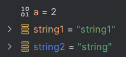
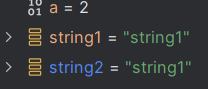
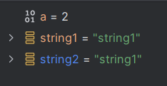

# Donat el projecte IntelliJ adjunt, comproveu mitjançant depuració del sistema:

## En la función1… Què fan aquestes línies de codi?:

String string2 = "string2";  // Asigna a la variable string2 la cadena de caracteres “string2”

string2= string2.substring(0, string2.length()-1); //Asigna a la variable string2 la subcadena “string”, que es lo que contenía la variable string2 antes de ser asignada quitando la última posición de la cadena (“2”).

string2=string2+"1"; //añade al contenido de la variable string2 el carácter “1”
 

## Què valen les variables string1 i string2 abans d'executar el codi de comprovació següent?
 
El valor de las dos variables es “string1”.

## Per què no funciona l'operador == ? Quin operador s'ha d'usar en lloc d'aquest?
No se puede comparar el contenido de dos variables string con “==” ya que lo que comparar es si las dos instancias son iguales, en este caso son dos instancias distintas aunque contengan lo mismo.

Para comparar strings se utiliza la función equals():
 

## La función2() està declarada com segueix:
public void funcion2() {
System.out.println("--------------------");
System.out.println("Aquesta és la funció 2");
System.out.println("Com faig la crida perquè funcione????");
}
Aquesta funció com l'he de cridar des del mètode MAIN perquè funcione. Existeixen 2 possibilitats. Explica-les.

1.	Llamando al método desde la función principal, es decir, desde function1();
2.	Instanciando un objeto de la clase y llamando a dicho método.
