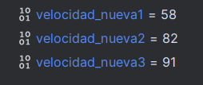

# Donat el codi a JAVA de la classe cotxe que compta amb els mètodes:
• constructor on se li estableix la marca, model, color i la velocitat inicial del qual és 0.
• getters i setters de cada paràmetre.
• Mètode accelera (int vel) que incrementa la velocitat del cotxe en “vel” Km/h.
• Mètode frena(int vel) que decrementa la velocitat del cotxe en “vel” Km/h.
• para() que posa la velocitat a 0.
• pinta() que pinta el cotxe més a prop o més lluny segons la velocitat que tinga en aqueix
moment.
A més , la classe Principal té el mètode:
pubic static void main(String [] args) → punt d'inici del programa

## Importar el projecte en INTELLIJ

Para abrir el proyecto debemos descomprimir el proyecto de la práctica y con INTELLIJ elegimos la opción de abrir proyecto.

Ya tendríamos el proyecto listo para poder ser depurado. 

## Explicad QUÈ FA EL MÈTODE MAIN.

El método MAIN se encarga de incializar 3 coches con sus valores correspondientes, además, asigna a cada coche una velocidad aleatoria hasta la que tiene que acelerar.

Muestra esos valores iniciales

Y a continuación hace frenar a los coches a una velocidad aleatoria.

Y vuelve a mostrar los datos actualizados de los coches.

## Posad un punt de ruptura (breakpoint) en la línia 27 del mètode main de la classe Principal i esbrineu els valors de les variables velocitat_nueva1, velocitat_nueva2 i  velocitat_nueva3.

Al haber establecido el breakpoint en la línea 27, al pulsar sobre el botón de debug la aplicación se detendrá en dicho punto, pudiendo ver el contenido, tanto de los 3 objetos coche como de las tres variables de velocidad_nueva.

De esta forma podemos comprobar dichos valores, tal y como muestro en las capturas de pantalla.

## Esbrineu també quines dades tenen en els seus paràmetres els cotxes amb variables c,c2 i c3.
 

## Posad un punt de ruptura (breakpoint) en la línia 46 del mètode main de la classe Principal  esbrineu els valors de les variables velocitat_nueva1, velocitat_nueva2 i velocitat_nueva3.

En este caso ocurre lo mismo, hemos parado la aplicación en la linea 46, donde habiamos colocado el breakpoint.

Al haberlo detenido en dicho punto podemos ver los valores de los objetos coche y las variables velocidad_nueva.

En las capturas de pantalla podemos ver dichos valores.

## Esbrineu també quines dades tenen en els seus paràmetres els cotxes amb variables c,c2 i c3.

